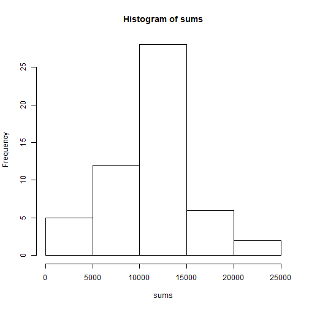
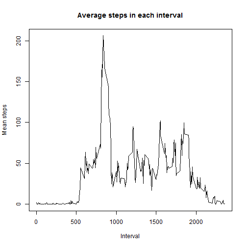
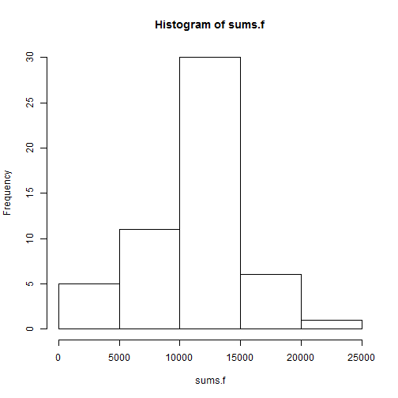
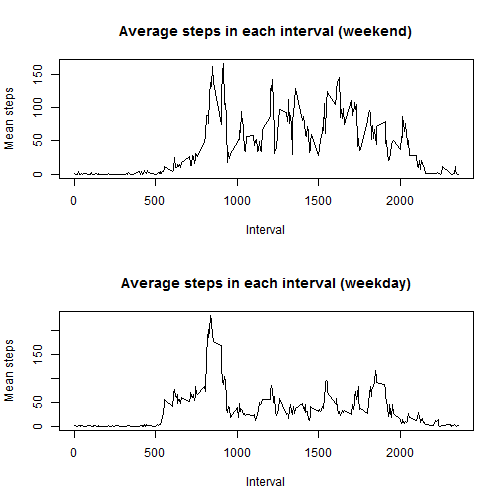

Getting and Processing the data
====

The first step is to read in the data. Since we are initially only interested in non-NA rows, we can eliminate them to create a "clean" data set.


```r
read.csv("activity.csv")->data
data[is.na(data$steps)==FALSE,]->data.clean
```
What is mean total number of steps taken per day?
===
We are interested in the total number of steps per day. The code below separates out the data into each individual day and evaluates the sum on each day.

```r
#separate out the dates since we need to add up by days.
dates<-(data.clean[,2])
#now split according to days.
sp<-split(data.clean,dates,drop=TRUE)
#initialize a sum vector and compute sums.
sums<-vector("numeric",
             length=length(names(sp)))
for (i in 1:length(sums)){
    sums[i]<-sum(as.data.frame(sp[i])[,1])
}
```
Now we plot out a historgram of the sums.

```r
#produce plot.
hist(sums)
```

 
  
We can also take means and medians for the number of steps each day.

```r
#initialize vector and compute medians:
meds<-vector("numeric",length=length(names(sp)))
for (i in 1:length(sums)){
    meds[i]<-median(as.data.frame(sp[i])[,1])
}
#put the sums and medians into a neat table for presentation.
summ.table<-as.data.frame(cbind(names(sp),sums,meds))
c("date","sum","median")->names(summ.table)
```
  
The table is produced below.

```r
summ.table
```

```
##          date   sum median
## 1  2012-10-02   126      0
## 2  2012-10-03 11352      0
## 3  2012-10-04 12116      0
## 4  2012-10-05 13294      0
## 5  2012-10-06 15420      0
## 6  2012-10-07 11015      0
## 7  2012-10-09 12811      0
## 8  2012-10-10  9900      0
## 9  2012-10-11 10304      0
## 10 2012-10-12 17382      0
## 11 2012-10-13 12426      0
## 12 2012-10-14 15098      0
## 13 2012-10-15 10139      0
## 14 2012-10-16 15084      0
## 15 2012-10-17 13452      0
## 16 2012-10-18 10056      0
## 17 2012-10-19 11829      0
## 18 2012-10-20 10395      0
## 19 2012-10-21  8821      0
## 20 2012-10-22 13460      0
## 21 2012-10-23  8918      0
## 22 2012-10-24  8355      0
## 23 2012-10-25  2492      0
## 24 2012-10-26  6778      0
## 25 2012-10-27 10119      0
## 26 2012-10-28 11458      0
## 27 2012-10-29  5018      0
## 28 2012-10-30  9819      0
## 29 2012-10-31 15414      0
## 30 2012-11-02 10600      0
## 31 2012-11-03 10571      0
## 32 2012-11-05 10439      0
## 33 2012-11-06  8334      0
## 34 2012-11-07 12883      0
## 35 2012-11-08  3219      0
## 36 2012-11-11 12608      0
## 37 2012-11-12 10765      0
## 38 2012-11-13  7336      0
## 39 2012-11-15    41      0
## 40 2012-11-16  5441      0
## 41 2012-11-17 14339      0
## 42 2012-11-18 15110      0
## 43 2012-11-19  8841      0
## 44 2012-11-20  4472      0
## 45 2012-11-21 12787      0
## 46 2012-11-22 20427      0
## 47 2012-11-23 21194      0
## 48 2012-11-24 14478      0
## 49 2012-11-25 11834      0
## 50 2012-11-26 11162      0
## 51 2012-11-27 13646      0
## 52 2012-11-28 10183      0
## 53 2012-11-29  7047      0
```
What is the average daily activity pattern?
===
We can also observe patterns for the same time interval across all days. First we separate out the data by interval rather than date.

```r
data.1<-as.data.frame(cbind(data.clean[,1:2],as.factor(data.clean$interval)))
c("steps","date","interval")->names(data.1)
#split.
sp.int<-split(data.1,data.1$interval)
#generate the vector and fill.
mean<-vector("numeric",length=length(names(sp.int)))
for (i in 1:length(names(sp.int))){
    mean[i]<-mean(as.data.frame(sp.int[i])[,1])
}
```
A line plot of the average activity for each interval is below.

```r
plot(as.numeric(levels(data.1$interval)),mean,type = "l",xlab="Interval",
ylab="Mean steps",main="Average steps in each interval")
```

 
  
If we want to find the interval with the highest average activity, we can readily do so in R.

```r
x<-(c("Max interval",which(mean==max(mean))))
y<-(c("Max mean",max(mean)))
print(as.data.frame(rbind(x,y)))
```

```
##             V1               V2
## x Max interval              104
## y     Max mean 206.169811320755
```
Imputing missing values
===
How many NA rows are there? Recall that data.clean omits NA rows, so the difference between nrow(data) and nrow(data.clean) is it.

```r
missingRows=nrow(data)-nrow(data.clean)
```
We now make an attempt to deal with the entire data set by filling in an estimate for all NA rows. We first try to identify if days with NA rows and days without are mutually exclusive.

```r
data.na<-data[is.na(data$steps)==TRUE,]
#is there any overlap between days with NA and days without? 
intersect(data.na[,2],data.clean[,2])
```

```
## character(0)
```
From the output above, it is clear that NA and non-NA days are mutually exclusive. However, since NA days only have NA values, we can estimate the activity using the means for each interval computed in the last section.

```r
longMean<-rep(mean,8)
data.2<-as.data.frame(cbind(longMean,data.na[,2:3]))
c("steps","date","interval")->names(data.2)
```
Now we put the two data sets (the clean and estimated NA sets) together and form the "full" data set. We then use the same process as in Section 2 to get the total steps per day, the mean, and the median.

```r
#now put the data sets back together.
data.full<-rbind(data.clean,data.2)
#sort by date.
x<-as.Date(data.full$date)
df<-data.full[order(x),]
#split.
sp.full<-split(data.full,data.full$date)
#compute sums
sums.f<-vector("numeric",length=length(names(sp)))
for (i in 1:length(sums.f)){
    sums.f[i]<-sum(as.data.frame(sp.full[i])[,1])
}
```
The historgram is below. 

```r
#produce plot.
hist(sums.f)
```

 
  
And the sums and medians table is below.

```r
#make table.
meds.f<-vector("numeric",length=length(names(sp)))
for (i in 1:length(sums)){
    meds.f[i]<-median(as.data.frame(sp.full[i])[,1])
}
sum.table.f<-as.data.frame(cbind(names(sp),sums.f,meds.f))
c("date","sum","median")->names(sum.table.f)
print(sum.table.f)
```

```
##          date              sum           median
## 1  2012-10-02 10766.1886792453 34.1132075471698
## 2  2012-10-03              126                0
## 3  2012-10-04            11352                0
## 4  2012-10-05            12116                0
## 5  2012-10-06            13294                0
## 6  2012-10-07            15420                0
## 7  2012-10-09            11015                0
## 8  2012-10-10 10766.1886792453 34.1132075471698
## 9  2012-10-11            12811                0
## 10 2012-10-12             9900                0
## 11 2012-10-13            10304                0
## 12 2012-10-14            17382                0
## 13 2012-10-15            12426                0
## 14 2012-10-16            15098                0
## 15 2012-10-17            10139                0
## 16 2012-10-18            15084                0
## 17 2012-10-19            13452                0
## 18 2012-10-20            10056                0
## 19 2012-10-21            11829                0
## 20 2012-10-22            10395                0
## 21 2012-10-23             8821                0
## 22 2012-10-24            13460                0
## 23 2012-10-25             8918                0
## 24 2012-10-26             8355                0
## 25 2012-10-27             2492                0
## 26 2012-10-28             6778                0
## 27 2012-10-29            10119                0
## 28 2012-10-30            11458                0
## 29 2012-10-31             5018                0
## 30 2012-11-02             9819                0
## 31 2012-11-03            15414                0
## 32 2012-11-05 10766.1886792453 34.1132075471698
## 33 2012-11-06            10600                0
## 34 2012-11-07            10571                0
## 35 2012-11-08 10766.1886792453 34.1132075471698
## 36 2012-11-11            10439                0
## 37 2012-11-12             8334                0
## 38 2012-11-13            12883                0
## 39 2012-11-15             3219                0
## 40 2012-11-16 10766.1886792453 34.1132075471698
## 41 2012-11-17 10766.1886792453 34.1132075471698
## 42 2012-11-18            12608                0
## 43 2012-11-19            10765                0
## 44 2012-11-20             7336                0
## 45 2012-11-21 10766.1886792453 34.1132075471698
## 46 2012-11-22               41                0
## 47 2012-11-23             5441                0
## 48 2012-11-24            14339                0
## 49 2012-11-25            15110                0
## 50 2012-11-26             8841                0
## 51 2012-11-27             4472                0
## 52 2012-11-28            12787                0
## 53 2012-11-29            20427                0
```
Are there differences in activity patterns between weekdays and weekends?
===
First, we set up a factor variable differentiating between weekdays and weekends. 

```r
data.full$date<-as.Date(data.full$date,format="%Y-%m-%d")
day.status<-vector("numeric",length=nrow(data.full))
for (i in 1:nrow(data.full)){
    if(weekdays(data.full$date[i])=="Saturday"){
        day.status[i]<-0
    } else if(weekdays(data.full$date[i])=="Sunday"){
        day.status[i]<-0
    } else {  
        day.status[i]<-1
    }
}
#setup the factor variable.
ds<-factor(day.status)
levels(ds)<-c("weekend","weekday")
```
We add this factor variable to the table and split the table along the weekday factor variable. 

```r
#create ds table.
tab<-as.data.frame(cbind(data.full,ds))
weekday<-tab[tab$ds=="weekday",]
weekend<-tab[tab$ds=="weekend",]
#generatre means.
sp.weekday<-split(weekday,weekday$interval)
sp.weekend<-split(weekend,weekend$interval)
```
We then generate the means for each interval over weekdays and weekends separately.

```r
#generate the vector and fill.
mean.weekday<-vector("numeric",length=length(names(sp.weekday)))
mean.weekend<-vector("numeric",length=length(names(sp.weekend)))
for (i in 1:length(names(sp.weekday))){
    mean.weekday[i]<-mean(as.data.frame(sp.weekday[i])[,1])
}
for (i in 1:length(names(sp.weekend))){
    mean.weekend[i]<-mean(as.data.frame(sp.weekend[i])[,1])
}
```
Finally, we plot the two charts.

```r
par(mfrow=c(2,1))
plot(unique((weekend$interval)),mean.weekend,type = "l",xlab="Interval",ylab="Mean steps",
main="Average steps in each interval (weekend)")
plot(unique((weekday$interval)),mean.weekday,type = "l",xlab="Interval",ylab="Mean steps",
main="Average steps in each interval (weekday)")
```

 
